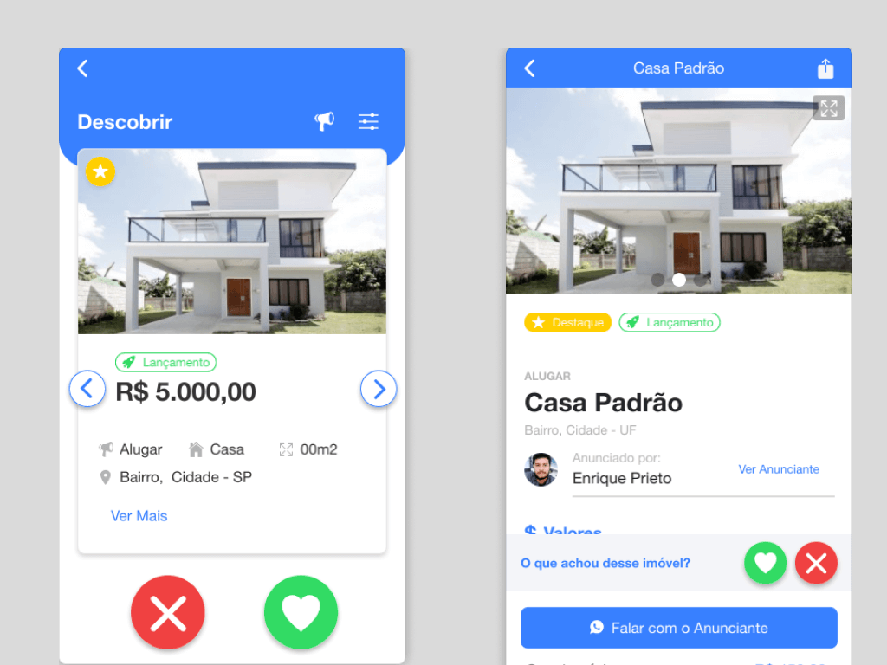
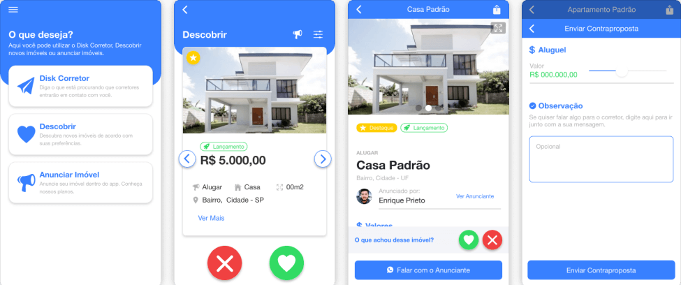

# Projeto iVendi

O projeto **iVendi** foi um trabalho voltado ao mercado imobiliário, onde o objetivo era oferecer uma nova experiência da pessoa encontrar seu próximo imóvel, seja para comprar ou alugar. Neste artigo irei compartilhar todo o trabalho realizado e apresentar o resultado final do projeto.

<!--truncate-->

## Design{#design}

Desde o início do projeto havia um interesse de criar um aplicativo que oferecesse uma nova experiência para as pessoas encontrar o seu próximo imóvel. Se você já precisou encontrar uma casa para alugar ou comprar, deve ter percebido que a maioria dos sites de imobiiárias são da mesma forma. 

Outro objetivo do projeto era oferecer uma comunicação direta com um corretor que estaria anunciando o imóvel no aplicativo. Uma das dores dos corretores era que nos sites das imobiliárias eles não tinha uma comunição direta com a pessoa que estava buscando o imóvel ou precisava passar por um chat interno o que deixava a experiência mais massiva de fazer.

Então juntando uma proposta de criar uma nova experiência de usuário e resolver uma dor, era um momento certo para encontrar algo que  _**dê match**_. 

### Tinder {#design-tinder}

Fora o trocadilho acima, era uma comunicação que tinha com os **stackeholders** que acabou virar uma inspiração usar o modelo do Tinder para exibir os imóveis para o usuário. A interação era simples, se gostou do imóvel aperte no _like_ se não no _dislike_.

### Fluxos {#design-fluxos}

Foi preciso criar vários fluxos para mapear o uso, navegação do usuário e garantir uma boa experiência do usuário. Abaixo irei destacar os principais fluxos criados:

#### Principal {#design-fluxos-principal}

No fluxo principal é o fluxo onde o usuário vai encontrar novos imóveis, visualizar e entrar em contato com o corretor.

