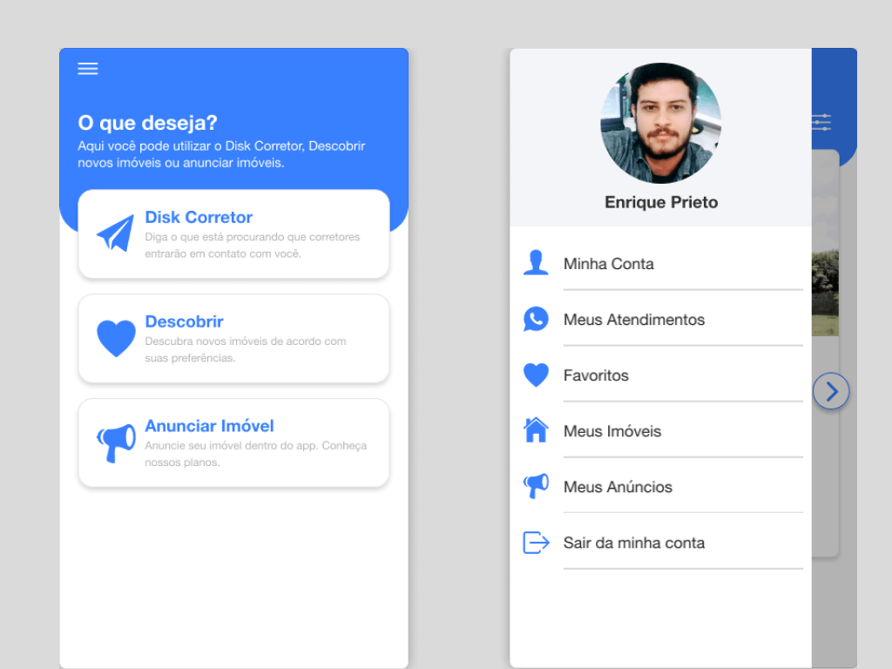

# Projeto iVendi

O projeto **iVendi** foi um trabalho voltado ao mercado imobiliário, onde o objetivo era oferecer uma nova experiência da pessoa encontrar seu próximo imóvel, seja para comprar ou alugar. Neste artigo irei compartilhar todo o trabalho realizado e apresentar o resultado final do projeto.

<!--truncate-->

## Design{#design}

Desde o início do projeto havia um interesse de criar um aplicativo que oferecesse uma nova experiência para as pessoas encontrar o seu próximo imóvel. Se você já precisou encontrar uma casa para alugar ou comprar, deve ter percebido que a maioria dos sites de imobiiárias são da mesma forma. 

Outro objetivo do projeto era oferecer uma comunicação direta com um corretor que estaria anunciando o imóvel no aplicativo. Uma das dores dos corretores era que nos sites das imobiliárias eles não tinha uma comunição direta com a pessoa que estava buscando o imóvel ou precisava passar por um chat interno o que deixava a experiência mais massiva de fazer.

Então juntando uma proposta de criar uma nova experiência de usuário e resolver uma dor, era um momento certo para encontrar algo que  _**dê match**_. 

### Ferramentas Utilizadas {#design-ferramentas-utilizadas}

Para realizar as criações utilizei algumas técnicas e ferramentas.

| Área  | Tipo          | Nome            |
|-------|---------------|-----------------|
| UX    | Técnica       | Wireframe       |
| UI    | Ferramenta    | Adobe XD        |
| UI    | Design System | Ionic Framework |
| UI    | Ícones        | Ionic Framework |

### Tinder {#design-tinder}

Fora o trocadilho acima, era uma comunicação que tinha com os **stackeholders** que acabou virar uma inspiração usar o modelo do Tinder para exibir os imóveis para o usuário. A interação era simples, se gostou do imóvel aperte no _like_ se não no _dislike_.

### Fluxos {#design-fluxos}

Foi preciso criar vários fluxos para mapear o uso, navegação do usuário e garantir uma boa experiência do usuário. Abaixo irei destacar os principais fluxos criados:

#### Principal {#design-fluxos-principal}

No fluxo principal é o fluxo onde o usuário vai encontrar novos imóveis, visualizar e entrar em contato com o corretor.

#### Navegação {#design-fluxos-navegacao}

Nossa missão quando estamos projetando uma interface para o usuário é permitir que ele consiga navegar e encontrar o que ele procura dentro da interface. Então uma barra de navegação é uma solução bem útil.

#### Autenticação {#design-fluxos-autenticacao}

Nesse projeto teve uma necessidade para que os usuários tivesse uma conta criada, então precisamos fazer uma forma que o usuário podesse se autenticar na aplicação.

#### Cadastro de Cliente {#design-fluxos-cadastro-cliente}

Todo usuário cadastrado no projeto ele virava um cliente. Então após o usuário criar a conta e é o primeiro acesso dele, criamos um formulário mais limpo para dar uma experiência de fazer uma pergunta de cada vez para o usuário.

#### Cadastro de Anunciante {#design-fluxos-cadastro-anunciante}

Como comentei no fluxo anterior, todo usuário era um cliente, mas ele tem a opção de se tornar um anunciante. Para oferecer essa modalidade pensamos em colocar ele em em várias partes da aplicação. No início logo após ele finalizar o fluxo de [Cadastro de Cliente](#desing-fluxos-cadastro-cliente), na tela principal e na tela do _"match"_.

#### Cadastro de Imóvel {#design-fluxos-cadastro-imovel}

Precisamos permitir que os próprios anunciantes consigam cadastrar os imóveis para poder anunciar.

<!--  -->

#### Cadastro de Anúncio {#design-fluxos-cadastro-anuncio}

Para o imóvel aparecer na listagem do usuários, o anunciante precisa criar um anúncio para o imóvel.

<!--  -->

#### Perfil {#design-fluxos-perfil}

Um fator muito importante quando se está criando um projeto é poder permitir que o usuário consiga editar suas informações.

<!--  -->

#### Plano {#design-fluxos--plano}

Criamos também esse fluxo para dar mais credibilidade ao usuário que é anunciante, que é importante já que ele vai deixar registrado dados sensíveis na plataforma para a assinatura estar ativa.

<!--  -->

#### Favoritos {#design-fluxos-favoritos}

No decorrer da criação dos fluxos nasceu uma necessidade de oferecer ao usuário um caminho para poder visualizar os imóveis que ele deu _like_.

<!--  -->

#### Anúncios {#design-fluxos-anuncios}

Para entregar mais valor aos anunciantes, criamos esse fluxo para o anunciante poder visualizar os dados de performance dos anúncios criados.

<!--  -->

---

## Desenvolvimento {#desenvolvimento}

Quando surgir a oportunidade de desenvolver esse projeto, decidi projeta-lo utilizando algumas ferramentas que eu já tinha familiaridade. Esse projeto teve seus desafios, como a parte de oferecer assinatura dentro do aplicativo, foi preciso realizar uma integração de um `API` externa de um forncedor.

Na época eu estava trabalhando muito com o `Angular` e o `Ionic Framework`, já sabia criar bastante coisa utilizando o Design System deles. Então quando projetei a UI já estava imaginando o comportamento que eu esperava que a interface fizesse, e isso ajudou bastante, porque alguns detalhes já havia pensado anteriormente e me fez ser mais objetivo na hora de codar.

### Ferramentas utilizadas {#desenvolvimento-ferramentas-utilizadas}

Bom alguns já citei acima, mas vou listar aqui as tecnologias que utilizei no projeto.

#### Banco de Dados {#desenvolvimento-ferramentas-utilizadas-banco-de-dados}

| Nome                 | Descrição                                                                                                            |
|----------------------|----------------------------------------------------------------------------------------------------------------------|
| `MySQL`              | Escolhi um banco de dados relacional para registrar todos dados que o aplicativo, api e dashboard iriam compartilhar |

#### Dashboard {#desenvolvimento-ferramentas-utilizadas-dashboard}

| Nome                 | Descrição                                                                                                      |
|----------------------|----------------------------------------------------------------------------------------------------------------|
| `PHP`                | Linguagem de servidor para o Laravel                                                                           |
| `Laravel`            | Framework muito poderoso para construção de sistemas e API                                                     |
| `Ionic Framework`    | Utilizado apenas o Design System para criar a `UI` do Dashboard                                                |
| `VueJs`              | Framework front-end fácil de construir `UI` e já vem no projeto `Laravel`                                      |
| `Javascript`         | O Dashboard não necessitada de outra tecnologia mais robusta                                                   |
| `Sass`               | Para facilitar a escrita de estilo e poder criar padrões dentro do Design System de forma customizada.         |
| `Laravel Mix`        | É uma ferramenta que já vem no `Laravel` mas ajuda bastante para abstrair a complexidade de montar um `webpack`|

#### API {#desenvolvimento-ferramentas-utilizadas-api}

| Nome               | Descrição                                                                                                    |
|--------------------|--------------------------------------------------------------------------------------------------------------|
| `PHP`              | Linguagem de servidor utilizada pelo `Laravel`                                                               |
| `Laravel`          | Esse framework ajuda bastante na criação de API e abstrai muitos problemas relacionados a web e servidor.    |
| `GoogleMaps API`   | Utilizei o decode para conseguir dados de localização seja por CEP ou passando latitude ou longitude.        |

#### Aplicativo {#desenvolvimento-ferramentas-utilizadas-aplicativo}

| Nome               | Descrição                                                                                                                                            |
|--------------------|------------------------------------------------------------------------------------------------------------------------------------------------------|
| `TypeScript`       | Linguagem utilizada pelo Angular                                                                                                                     |
| `Angular`          | É um framework front-end muito completo que me ajudou a bastante contruir uma aplicação web.                                                         |
| `Ionic Framework`  | Com o Design System completo e bem dinâmico acelerou bastante o desenvolvimento do proejto.                                                          |
| `Firebase Auth`    | Como serviço de autenticação de usuários utilizei o Firebase porque ele já abstraiu todo aquele trabalho de criar usuario, controle de sessão etc.   |
| `Sass`             | Para facilitar a escrita de estilo e poder criar padrões dentro do Design System de forma customizada.                                               |
| `FacebookLogin`    | No nativo era preciso utilizar um plugin nativo de login do Fabebook                                                                                 |
| `AppleLogin`       | No nativo era preciso utilizar um plugin nativo de login da Apple                                                                                    |
| `Cordova`          | Ferramenta que consegue transformar nosso aplicativo web em aplicativo WebView no IOS e Android.                                                     |
